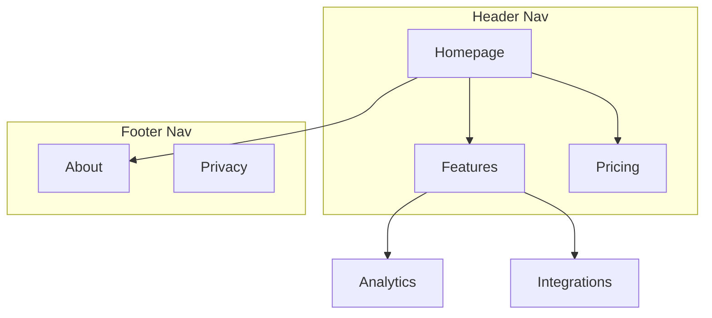

# Site architecture for SEO — reference

Behind the "Site architecture" section of `SKILL.md`. Information architecture, URLs, and internal linking for crawlability and authority flow. (This is SEO/IA — code folder structure is `code-structure`.)

## URL structure

Principles:

- **Readable by humans**, **lowercase**, **hyphens** (not underscores), **short but descriptive**.
- **Mirror the hierarchy** (`/blog/category/post`), so the URL communicates location.
- **One trailing-slash policy** and one case policy — pick and enforce via redirect. (The chosen policy is a **project fact → `AGENTS.md`**.)

Common mistakes:

- **Missing 301s** — every removed/changed URL needs a 301 to its replacement, or you lose backlink equity. (The #1 architecture mistake.)
- Dates in evergreen blog URLs; database IDs or query params for content pages; over-nesting; inconsistent patterns.

URL patterns by page type (typical):

```
/                         home
/pricing, /about          top-level pages
/blog, /blog/[slug]       content
/[category]/[product]     e-commerce
/docs/[section]/[page]    docs
/compare/[x]-vs-[y]       comparisons
```

## Hierarchy & crawl depth

- Go **as flat as the content allows** while keeping navigation clear — shallow pages are crawled more and read as more important.
- Keep important pages within ~3 clicks. (The "3-click rule" is a useful heuristic, **not a law** — clarity/scent matters more than a hard count.)

## Internal linking (authority flow)

- **No orphan pages** — every page has ≥1 internal link.
- **Descriptive anchor text** ("our analytics features", not "click here") — the anchor tells search engines what the target is about.
- Link to important pages more often; link related pages to each other.
- Navigation must be **crawlable HTML `<a href>`** — not JS-only click handlers (→ `html-best-practices`).

### Pillar / cluster (topic clusters)

The current model for topical authority: a **pillar** (hub) page covers a broad topic and links to **cluster** (spoke) pages on subtopics; each spoke links back to the pillar and to sibling spokes. This concentrates relevance and distributes authority.

## Breadcrumbs

Mirror the URL hierarchy; every segment is a link except the current page; ship `BreadcrumbList` structured data (→ `references/structured-data.md`). They aid crawling, UX, and can appear in the SERP.

## Navigation ergonomics (UX that also serves SEO)

- Header: ~4–7 primary items, primary CTA rightmost, logo links home; mega-menus kept shallow.
- A dropdown with **20+ items needs another level of hierarchy** — split it instead of scrolling it.
- Mega menus: **≤3–4 columns** — beyond that it's a sitemap, not navigation.
- Footer: group links by theme; it's a legitimate secondary nav, not a link dump.
- Contextual/in-content links carry strong topical signals — use them deliberately.

## Planning deliverables & output formats

When planning an architecture (new site or restructure), produce these five deliverables. ASCII for quick drafts and text-only contexts; Mermaid when relationships or nav zones need to be visual.

**1. Page hierarchy — ASCII tree** (every node carries its URL):

```text
Homepage (/)
├── Features (/features)
│   ├── Analytics (/features/analytics)
│   └── Integrations (/features/integrations)
├── Pricing (/pricing)
├── Blog (/blog)
│   └── [Category: SEO] (/blog/category/seo)
└── About (/about)
```

**2. Visual sitemap — Mermaid `graph TD`**, with subgraphs for nav zones where helpful:



**3. URL map table:**

| Page      | URL                   | Parent   | Nav location    | Priority |
| --------- | --------------------- | -------- | --------------- | -------- |
| Homepage  | `/`                   | —        | Header          | High     |
| Features  | `/features`           | Homepage | Header          | High     |
| Analytics | `/features/analytics` | Features | Header dropdown | Medium   |
| Pricing   | `/pricing`            | Homepage | Header          | High     |

**4. Navigation spec** — header items (ordered, with CTA), footer sections and links, sidebar nav if applicable, breadcrumb implementation notes.

**5. Internal-linking plan** — hub pages and their spokes, cross-section link opportunities (features ↔ case studies, blog ↔ product), orphan-page audit when restructuring, recommended links per key page.

## Site-type starting points

- **SaaS marketing** — shallow: home, product/features, pricing, use-cases, blog, comparisons.
- **Content/blog** — pillar pages + clusters; category/tag taxonomy kept lean.
- **E-commerce** — category → subcategory → product; watch faceted-nav duplication.
- **Docs** — section → page; strong in-content linking + search.

Use these as scaffolding, then shape to the real content — don't force a template.
